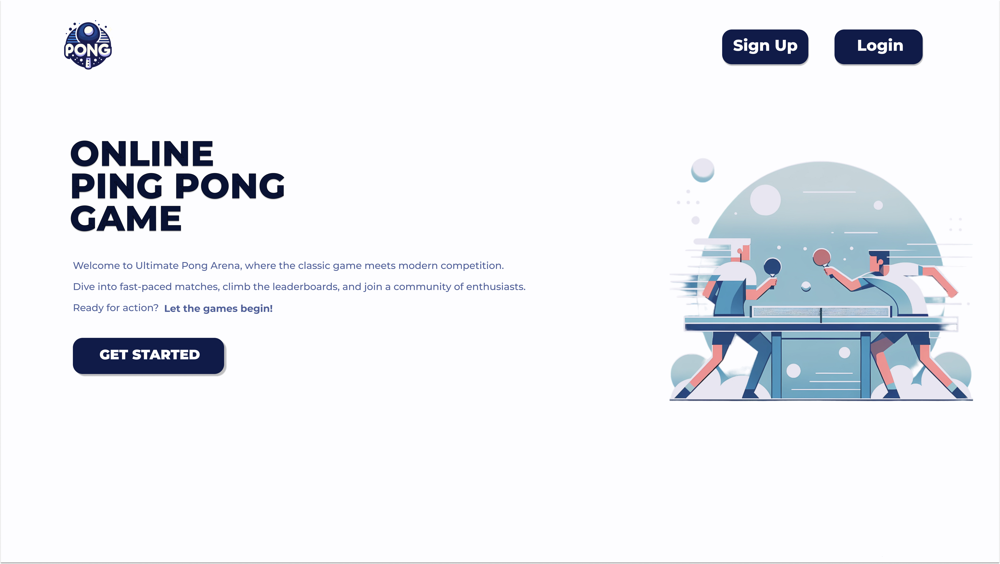

# ft_transcendence Project

## Project Overview

ft_transcendence is a comprehensive web development project from the 42 Network school, challenging students to create a full-featured online multiplayer Pong gaming platform.

## My Contributions

As a team member, My tasks where in the frntend , and I focused on :
- Implementing the chat page
- Developing user profile page
- Creating profile update page

### Technologies I Used
- React
- Next.js
- Tailwind css

## Project Highlights
- Real-time multiplayer Pong game
- Advanced user management system
- Live chat implementation
- Comprehensive user profiles

## Technologies and Skills Demonstrated
- Full-stack web development
- Real-time web application design
- User experience optimization
- Complex frontend architecture

ft_transcendence was an extensive project that significantly enhanced my web development skills, particularly in React and Next.js, while providing valuable experience in team collaboration and advanced system design.
